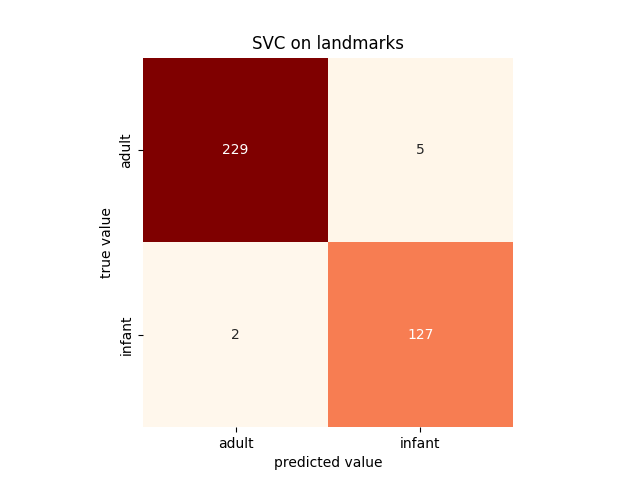
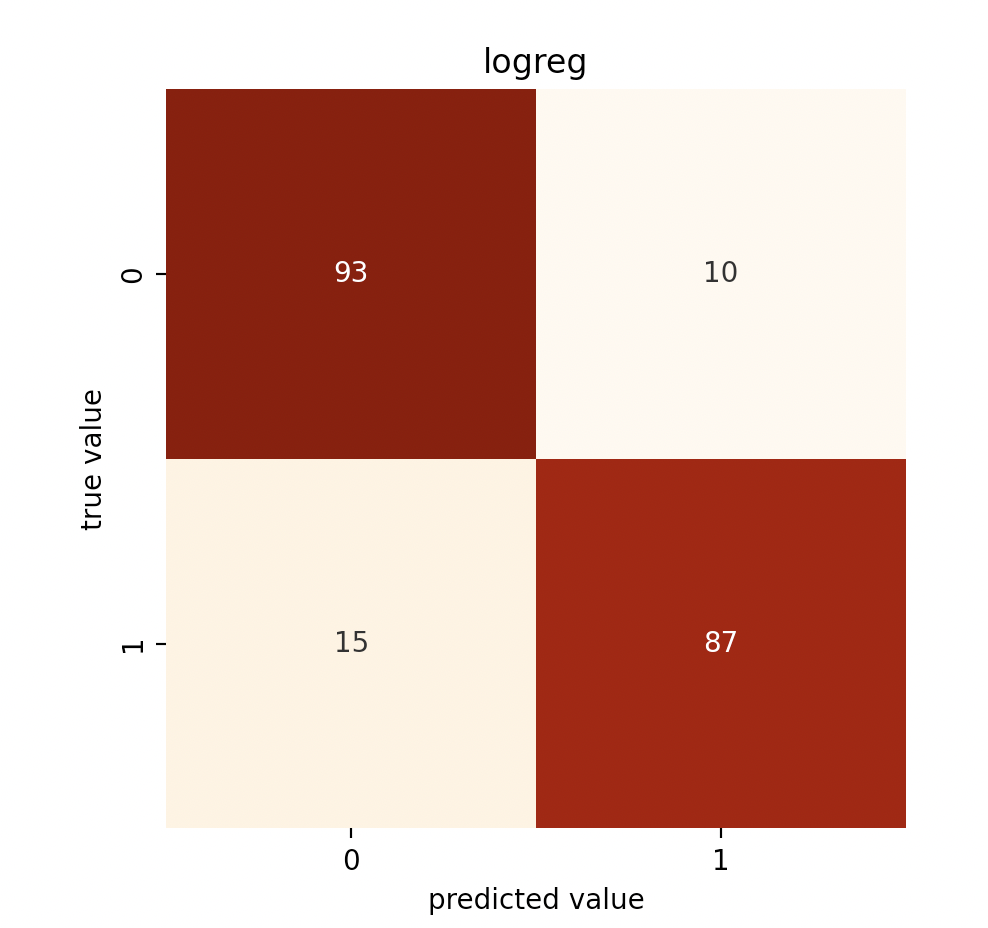
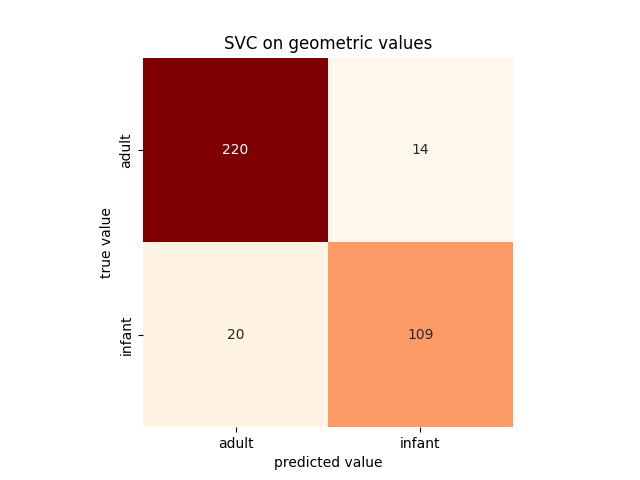
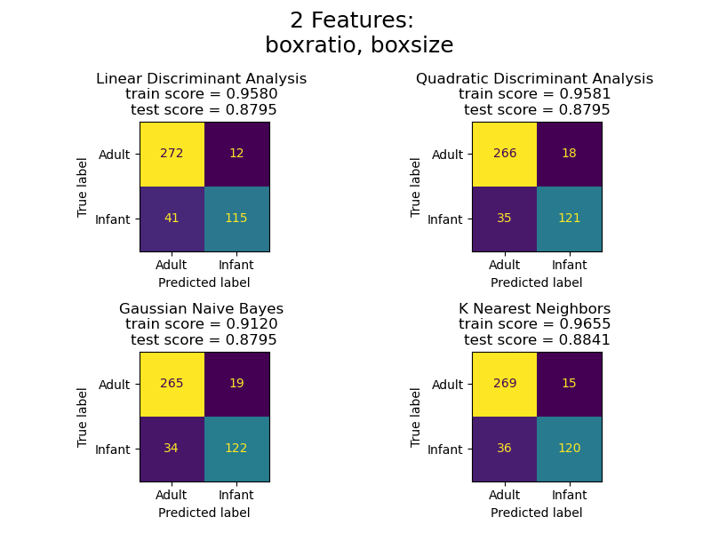

# DS5110 faces

This repo documents the development efforts in an exploratory data analysis and classical machine learning team project, as part of the classwork for DS5110, Fall 2022 at Northeastern University, Roux Institute.

## Goal and Overview

Our goal for this project is to apply classical machine learning models such as SVC, Logistic Regression, and Naive Bayes to classify adult vs infant faces using facial landmark data. 

* [Preprocessing](preprocessing.md)
* [Sampling](sampling.md)
* [Feature Selection](feature_selection.md)
* Training Models
  * [PCA > SVC](svc.md)
  * [Logistic Regression](logreg.md)
  * [LDA/QDA](lda.md)

## Challenges and Main Results

Our main challenge was preprocessing the data. The landmark data is generated from images, and sometimes those landmarks are turned, titled, or scaled differently. We accounted for these differences by "normalizing" the landmark points (refer to [preprocessing.md](preprocessing.md) for details). After preprocessing the data, we are able to generate several successful models with varying degrees of dimensionality.  

Our best "high" dimensional model is an SVC model with 55 features. Please refer to [svc.md](svc.md) for details and other results from this model.



Our best "mid" dimensional model is logistic regression with 7 features: Please refer to [logreg.md](logreg.md) for details and other results from this model.



Our best "low" dimensional model is SVC with 2 features: Please refer to [svc.md](svc.md) for details and other results from this model.



KNN with 2 features also did well: Please refer to [lda.md](lda.md) for details and other results from this model.



We found feature selection and resampling to be effective methods for improving model accuracy and recall score. Please refer to [Sampling](sampling.md)
and [Feature Selection](feature_selection.md) for details on these techniques.

## Data & Reproducibility
This project leverages the adult and infant facial landmark data from this repo: [Infant-Facial-Landmark-Detection-and-Tracking](https://github.com/ostadabbas/Infant-Facial-Landmark-Detection-and-Tracking).

To reproduce the results shown in this repository, first download the data and generate the additional features using the following two commands:
```
make merge_meta
make euclidian_data
```
To reproduce preprocessing steps: (see [preprocessing.md](preprocessing.md) for details)
```
make prelim_plots
make roll_yaw
make angles_logreg
make angle_outliers
make compare_normalized
```

To reproduce resampling steps: (see [resampling.md](ampling.md) for details)
```
make logreg_eda
make resample_test
```

To reproduce SVC model: (see [svc.md](svc.md) for details)
```
make svc_geometric
make svc_landmarks
```

To reproduce logistic regression model: (see [logreg.md](logreg.md) for details)
```
make logreg_eda
make make logreg_test
make logreg_4_pred
```

To reproduce Naive Bayes, LDA, QDA, & KNN models:
```
make **FIX**
```

## Dependencies

There is a [requirements.txt](requirements.txt) file at the root of the repo, as a convenience for installing dependencies. It is strongly recommended to create a new virtual environment for this project (see [pip/venv documentation](https://packaging.python.org/en/latest/guides/installing-using-pip-and-virtual-environments/) for details). You can install these locally with pip:
  ```
  pip install -r requirements.txt
  ```
  *Note: This file is not a minimally sufficient list of dependencies; it most certainly includes extraneous packages that happen to be in our initial development environment.*

## Acknowledgments
The data used in this project comes from InfAnFace: Bridging the Infant--Adult Domain Gap in Facial Landmark Estimation in the Wild.
Wan, M., Zhu, S., Luan, L., Prateek, G., Huang, X., Schwartz-Mette, R., Hayes, M., Zimmerman, E., & Ostadabbas, S. "InfAnFace: Bridging the infant-adult domain gap in facial landmark estimation in the wild." 26th International Conference on Pattern Recognition (ICPR 2022).
Data: [Infant-Facial-Landmark-Detection-and-Tracking](https://github.com/ostadabbas/Infant-Facial-Landmark-Detection-and-Tracking).

We also incorporated feedback and guidance from Dr. Michael Wan.
