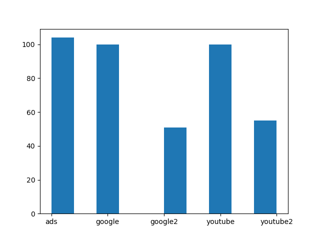
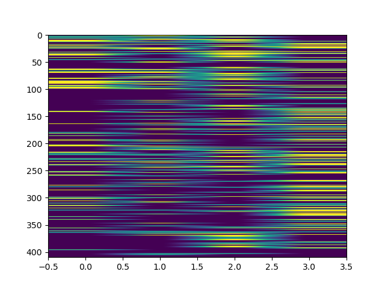
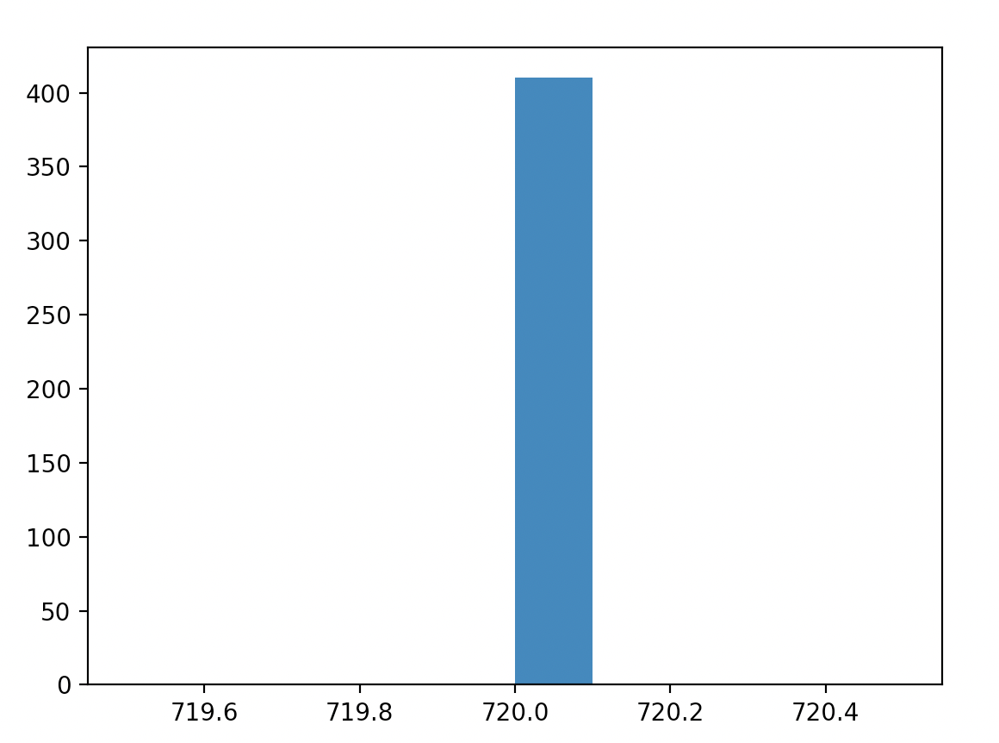
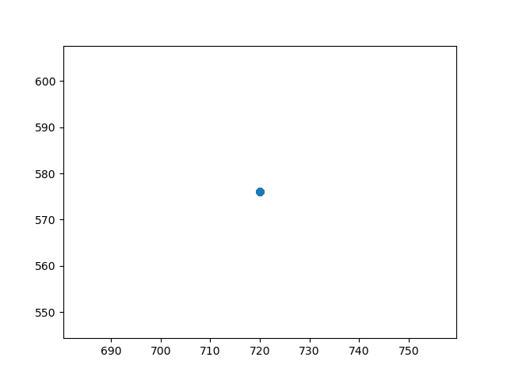
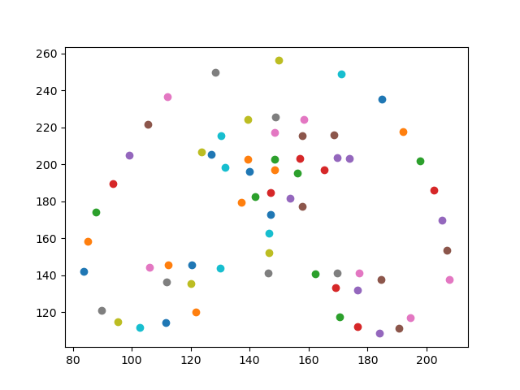

# DS5110-cv

## Data

This project uses data from this repo: [Infant-Facial-Landmark-Detection-and-Tracking](https://github.com/ostadabbas/Infant-Facial-Landmark-Detection-and-Tracking).

In order to minimize redundant downloads, this repo includes a [Makefile](Makefile) with a **data** target. Executing the **data** target will create a git-ignored sub-directory named "data", and download the required files into that location. The Python scripts that use the data expect the files are already downloaded and that the current working directory is the root of the repo.

There is also a convenience utility for loading these files, wrapped up in a utility module [util.local_cache](src/util/local_cache.py) that provides an interface `LocalCache` and default instance `cache` for accessing images and metadata, downloading them if they are not present locally.

## Preprocessing

In our initial exploration we tried plotting landmarks on a frontal view example image:

Then we tried drawing splines between subsets of points, to make detected features more clear:

We also tried to standardize the orientation by centering and rotating about the z-axis (using expected symmetry between eye landmarks to calculate the angle of rotation):

To confirm this, we applied this rotation/centering on a few other images:

Depending on the input data and type of models we are training, this type of preprocessing may be useful. See [angular](angular.md) doc for more info on angular transformation analysis.

## Other EDA
We also wanted to investigate some basic stats about the data, such as how many images are in the sets, and how many different images have the targets listed. Using the script `combos.py`, we found that there are more images in the adds google and youtube sets, with less in the google2 and youtube2 sets (I think this makes sense as the 2 sets are for testing). We also found out that there are more images with just one of the targets, like just tilted or just expressive. Less images are marked with multiple, and no images are marked with 'turned', 'occluded', and 'expressive'.

We preformed a check using `plot_shape.py` to see if the images were all the same size (same number of rows and columns) in order to find out if we needed to scale the values for further EDA. We found that they are the same size, see the histogram and scatterplot below. 

Because one idea for this project is creating a classifier of adult and infant faces, we also wanted to explore some of the adult face data. Using a similar script to `plot_gxgy.py`, we used `plot_adult.py` to plot the features.

