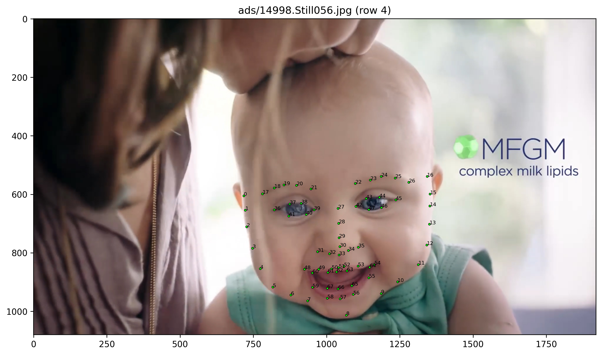
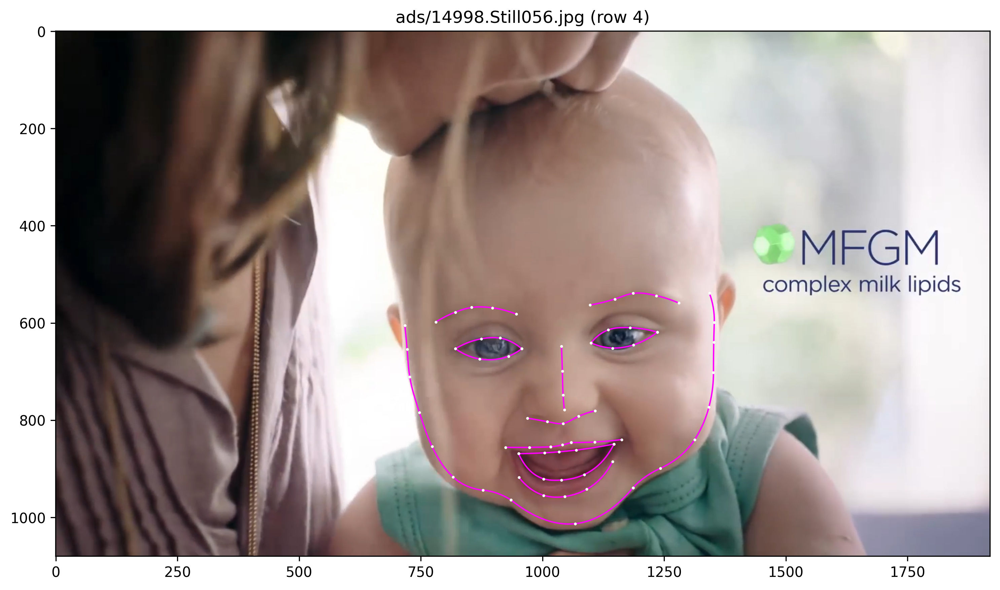
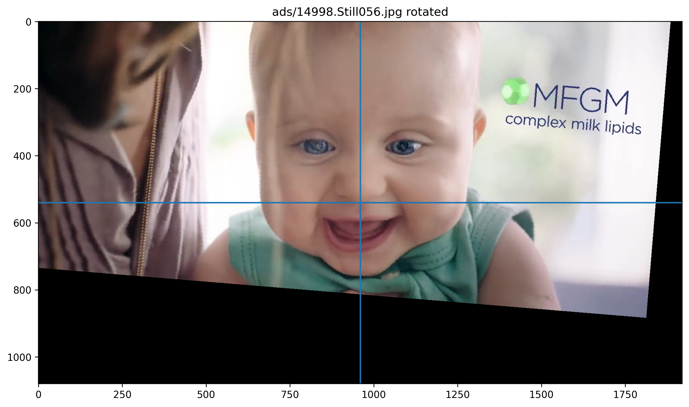
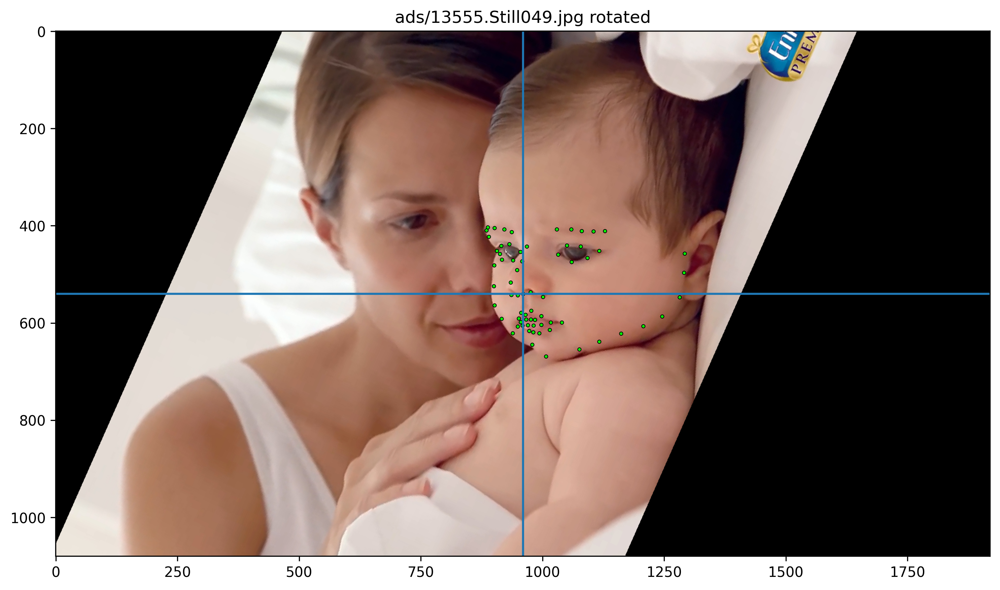
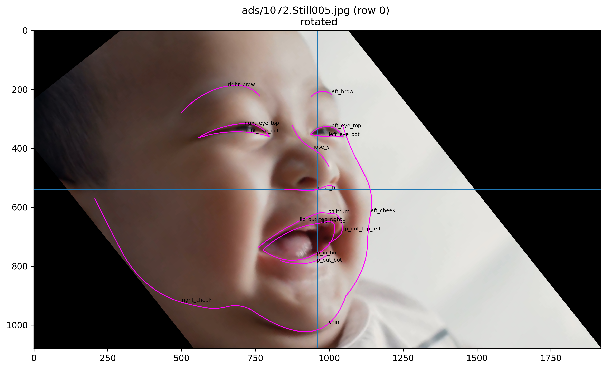

# DS5110 faces

This repo records the development efforts in an exploratory data analysis team project, as part of the classwork for DS5110, Fall 2022 at Northeastern University, Roux Institute.

## Data

This project primarily leverages data from this repo: [Infant-Facial-Landmark-Detection-and-Tracking](https://github.com/ostadabbas/Infant-Facial-Landmark-Detection-and-Tracking).

## Utilities

There are utilities in the `util` package for loading images and metadata. Along with a provisional [AnnoImg](util/model.py) model, these utilities enable the calculation of derived features and facilitate the plotting of modified images.

Default instances of data managers can be imported directly from the util package:
```
from util import cache      # for baby faces
from util import alt        # for adult faces
from util import meta_cache # for the combined dataset
```

*Note:* Cached images and metadata files are stored in a **data** sub-directory. When the current working directory is the root of the repo, this location will not be tracked by Git.

## Local Execution

There are a few "driver" scripts, located directly under `src`, that we use to modify and view images and metadata. For example, command line execution to apply a logistic regression model to identify challenging categories 'tilted' and 'turned' on the basis of derived features 'yaw' and 'roll':
```
python src/eg_logreg.py
```

## Dependencies

There is a [requirements.txt](requirements.txt) file at the root of the repo, as a convenience for installing dependencies. It is strongly recommended to create a new virtual environment for this project (see [pip/venv documentation](https://packaging.python.org/en/latest/guides/installing-using-pip-and-virtual-environments/) for details). You can install these locally with pip:
  ```
  pip install -r requirements.txt
  ```
  *Note: This file is not a minimally sufficient list of dependencies; it most certainly includes extraneous packages that happen to be  environment.*

## Preprocessing

For a full list of derived features, see [derived.md](derived.md).

In our initial exploration we tried plotting landmarks on a frontal view example image:



Then we tried drawing splines between subsets of points, to make detected features more clear:



We also tried to standardize the orientation by centering and rotating about the z-axis (using expected symmetry between eye landmarks to calculate the angle of rotation):



To confirm this, we applied this rotation/centering on a few other images:




Depending on the input data and type of models we are training, this type of preprocessing may be useful. See [angular.md](angular.md) doc for more info on angular transformation analysis.
