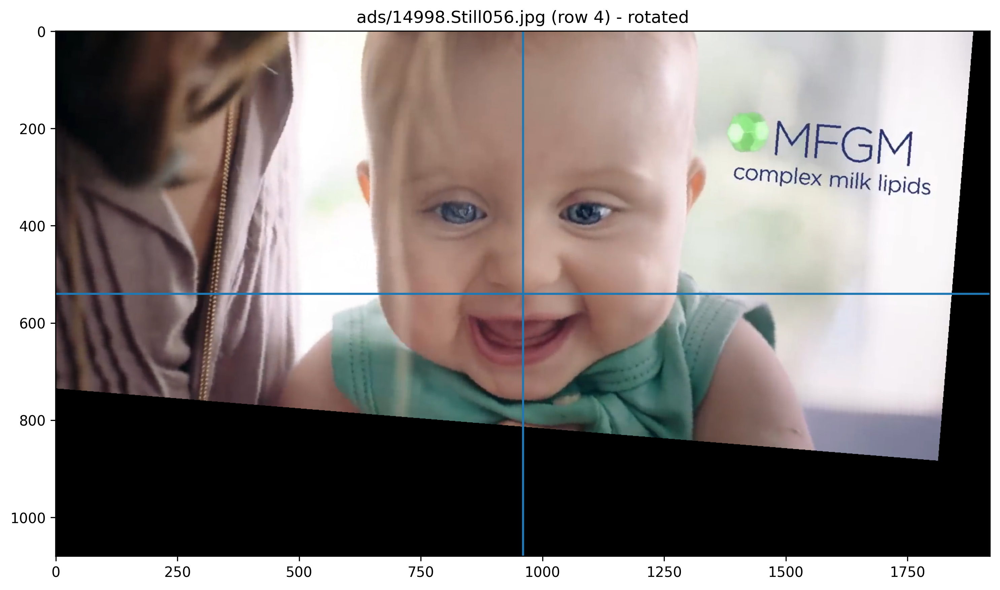
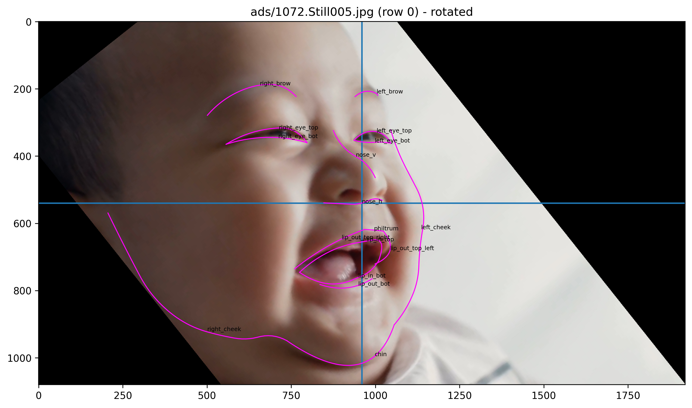

# DS5110-cv

## Data

This project uses data from this repo: [Infant-Facial-Landmark-Detection-and-Tracking](https://github.com/ostadabbas/Infant-Facial-Landmark-Detection-and-Tracking).

In order to minimize redundant downloads, this repo includes a [Makefile](Makefile) with a **data** target. Executing the **data** target will create a git-ignored sub-directory named "data", and download the required files into that location. The Python scripts that use the data expect the files are already downloaded and that the current working directory is the root of the repo.

There is also a convenience utility for loading these files, wrapped up in a utility module [util.local_cache](src/util/local_cache.py) that provides an interface `LocalCache` and default instance `cache` for accessing images and metadata, downloading them if they are not present locally.

## Preprocessing

In our initial exploration we tried plotting the landmarks on a frontal view example image:

Then we tried drawing splines between subsets of points, to make the detected features more clear:

We also tried to standardize the orientation by centering and rotating about the z-axis (using expected symmetry between the eye landmarks to calculate the angle of rotation):

To confirm this, we applied this rotation/centering on a few other images:

Depending on the type of models we are training, this type of preprocessing may be useful.
