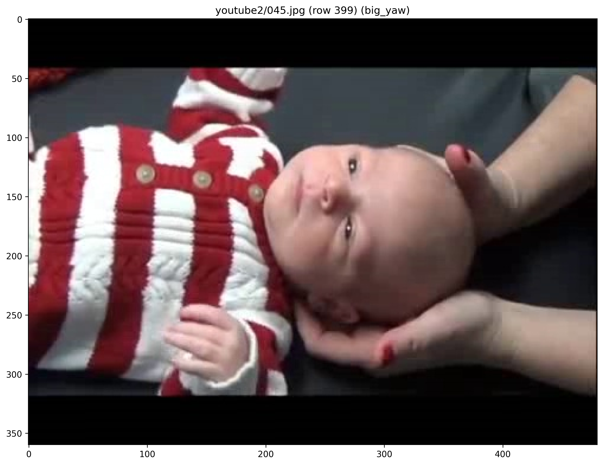

## Angular transformations

We would like to derive three components of head orientation: "roll", "pitch", and "yaw". We regard these from a graphical perspective: about the y-axis, x-axis, and z-axis, respectively (as opposed to anatomical terminology, where yaw might be about the medial axis, etc).

## Calculation of "yaw"

The calculation for yaw is a simple weighted average of angles between key landmarks (mainly the corners of eyes, or "canthi"). This has proven very effective, as manually verified for nearly all of the training data.

## Calculation of "roll"

The calculation for "roll" is much more tenuous. We assume the head is a sphere, with diameter equal to the maximum horizontal distance between cheek landmarks (after "yaw correction"). Then we take the nose point (landmark 33) as a point on the surface of said sphere and calculate the angle: `roll = arcsin((nose-mid)/radius)`

## Visualizing estimates

We plotted raw estimated angles against given categories "tilted" and "turned":

The classes are more linearly seperable when taking absolute values:

## Outliers

There are a few outliers, e.g. high yaw and not 'tilted' nor 'turned',
but they seem to be caused by inconsistent labeling or different ways of interpreting ~90 degree rotations.
For example, the maximum absolute yaw score among un-"tilted" and un-"turned images:

