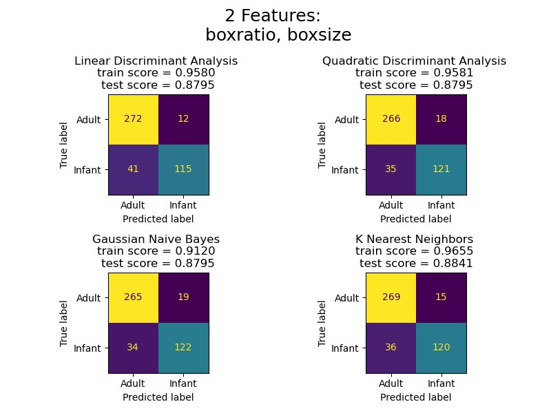

# DS5110 faces: LDA, QDA, Naive Bayes, K-Neighbors Summary

The purpose of this file is to explain the main takeaways from Bayesian and KNN model exploration.

### To reproduce the figures and models shown here:
run the following in your command prompt:
```
make bayes_figures
```

## 2-D Feature Space and Decision Boundaries

I think the best way to introduce these models is starting with a 'toy' version of the faces of the dataset; using only the `boxratio` and `boxsize/interoc` that are mentioned shown Table II in the InfAnFace paper:


The creation of these features from the original landmarks is described in `preprocessing.md`. 


Based on training models with just these two features and many techniques the irreducible error seems to be ~0.11, for predicting whether the original landmarks come from the helen dataset or InfAnFace dataset.


Titles of each plot show the modeling technique, and the accuracy score on a train-test-split of 40% test data.

The color boundary in each plot is the decision boundary, where the model places a 50% chance that an observation could be an infant or adult.

3 models - Linear Discriminant Analysis, Quadratic Discriminant Analysis, and Gaussian Naive Bayes - are Bayesian models.  

These models start by calculating a prior probability of each class based on their proportion in the data, i.e., 40 infant observations and 60 adult observations would result in prior probabilities of *P(infant)* = 0.40 and *P(adult)* = 0.60.  

Then, the models create posterior probabilities by updating those prior probabilities with calculations of each of the classes' distributions amongst the features.

The differences between the 3 models come from how each assumes different features are correlated with each class.

The simplest is Naive Bayes (GaussianNB), which assumes that all features are independent and normally distributed. While those assumptions are usually false and can lead to underperformance, this gives a low-variance technique that works well on high-dimensionality data. 

Linear Discriminant Analysis (LDA) still assumes a normal distribution for each feature, but does not assume that features are independent. The correlations between feature combinations is stored in a covariance matrix, that influences the posterior LDA.  

LDA calculates this covariance matrix assuming that the correlations are the same for every class. This reduces model complexity greatly, since the covariance matrix will be n*n for n features, leading to n<sup>2</sup> parameters for each matrix. Often, this strikes a useful bias-variance balance for typical datasets. 

Quadratic Discriminant Analysis (QDA) is the most complex and high-variance of the three, because it does the same calculations as LDA, but with a different covariance matrix for each class. 

Included in these figures is also a K-Nearest Neighbors classifier, that will be discussed in a later section.

So which model succeeds on the 2-D dataset?



These confusion matrices show how each classifier's accuracy varies for the adult and infant classes. All three coincidentally have the exact same accuracy score, but the recall score of infants is highest with LDA and about the same for QDA and GaussianNB.

I find it interesting that the decision boundaries for the simplest (GaussianNB) and most complex (QDA) are almost identical. However, the more useful distinction is seen on the training score, where QDA scores the highest.  

The caveat with a higher-variance model like QDA is that it will quickly overfit the data.

Here are ROC and Detection Error Tradeoff Curves for each model:


Area Under Curve (AUC) is a robust metric for comparing classifiers, where a higher score shows the model better avoids misclassification across all classification thresholds.

## The Original 68 Landmarks
We can explore the bias variance tradeoff in more depth by feeding these models a higher dimensionality dataset, in this case 68 x,y coordinates or 136 features:


## The Normalized, Centered and Rotated 68 Landmarks
Finally, we can compare teh


