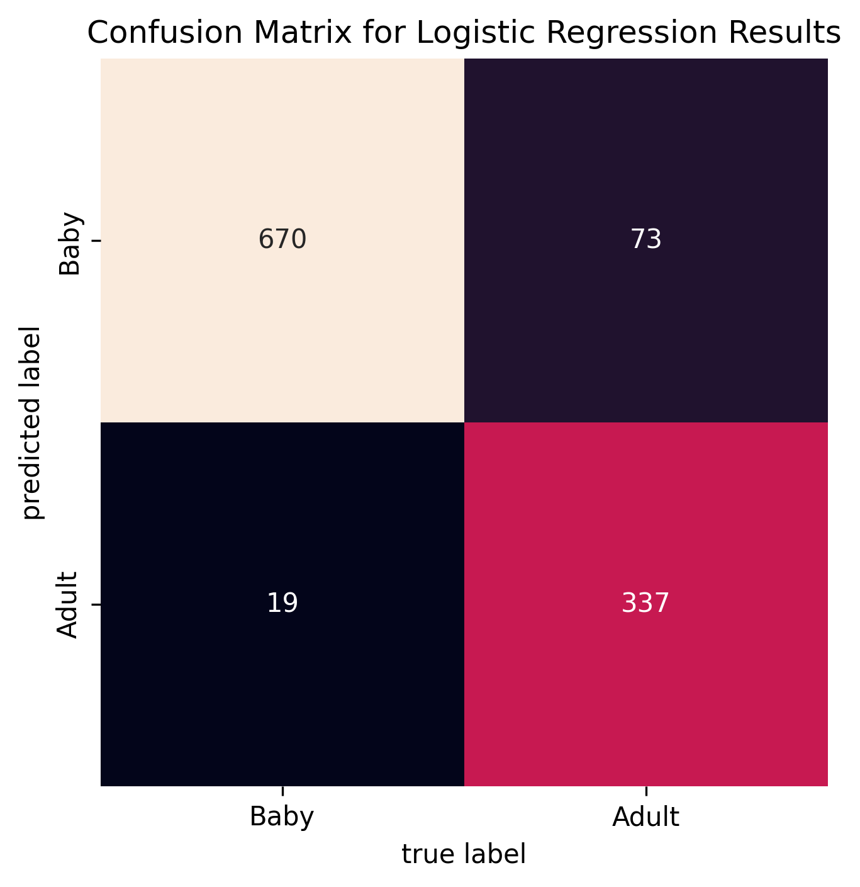

# DS5110 faces: Logistic Regression Summary

The purpose of this file is to explain the main takeaways from the logreg model exploration.

More information about EDA, sampling methods attempted, hyper-parameter tuning, and data partitions tested please see `notes/notes_logreg` and `notes/notes_logreg_dist`.

## Logistic Regression: Take 1

We tried using just four likely predictors "yaw_abs", "roll_abs", "boxratio", and "interoc_norm" to predict target "baby".

```
=====================================================
Classification Report
=====================================================
              precision    recall  f1-score   support

        baby       0.90      0.96      0.93       170
       adult       0.94      0.83      0.88       105

    accuracy                           0.91       275
   macro avg       0.92      0.90      0.91       275
weighted avg       0.91      0.91      0.91       275

	logreg score: 0.913
	coefficients:
		boxratio: 9.836838008155665
		yaw_abs: 3.2714741040479107
		interoc_norm: 1.4026847522362897
		roll_abs: 0.7687748782704812
	dummy score: 0.484
```

We plotted these results on a scatter of 'boxratio' vs 'yaw_abs' and a confusion matrix of the (small) validation set:




This is a rough first test using small random validation set, but it indicates that 'boxratio' is likely useful. We imagine 'yaw_abs' is _circumstantially_ useful, since babies are generally photographed from more extreme angles, if only because they have a hard time supporting their relatively large heads.

## Logistic Regression: Take 2
One of our goals is to test out different forms of resampling to balance the data. We wanted to know if resampling would have a positive impact on model accuracy. We found that "downsampled" scores were consistently better (even if it reduced the accuracy rating by 0.1 or so, the recall scores greatly improved), so we can conclude that downsampling is a good strategy for this model. 

Building off of our findings in Take 1 above, the "one feature" model using just `['boxratio']` stood out to us as pretty good. For more information on how this model preformed with other groups of features, please see `notes/notes_logreg`.

If you really wanted recall scores to be even better, the "13 feature" model with the normalized & rotated coordinate data appears to be better than the just normalized coordinate data given the similarity in scores and great reduction of features. This provides good evidence that the preprocessing adjustments done to the data are worthwhile.

In many of these instances, we did recursive feature selection to select the best (and minimum) number of features. Espeically in the cases where we are using 66+ features, we found that using feature selection greatly improved both the accuracy and recall scores of our model. This is likely due to logistic regression preforming better with minimal colinearity. 

One feature (`['boxratio']`), downsampling:
* Accuracy score: 0.88
* Recall score adult: 0.90
* Recall score baby: 0.85

CV to tune optimal features:


Confusion matrix:


66 features (normalized coord data), downsampling:
* Accuracy score: 0.94
* Recall score adult: 0.92
* Recall score baby: 0.96

13 features (normalized & rotated coord data), downsampling:
* Accuracy score: 0.94
* Recall score adult: 0.92
* Recall score baby: 0.96

CV to tune optimal features:


Confusion matrix:


To reproduce the results from this section run:
```
make logreg_test
```
## Logistic Regression: Take 3
Inspired by our sucess with using `boxratio` (ratio between the width and height of the head) as a single predictor, we had the idea of trying to identify more "distances" between facial features that could help classify adults vs infants.

After generating the pairwise euclidian distances, it became really obvious that we would need feature selection given the ammount of features. In fact, if you tried to run this model with all these new features, you run the risk of way overfitting the model. We thought that forward feature selection would be a good choice, as we can easily identify how and which additional distances will imporve the model. 

We also used downsampling here given the sucess of downsampling with the previous set of features.

We found that the classifier produced a pretty good score with just one feature, the euclidian distance from the left chin to left eye.
* Accuracy score: 0.83 (downsampling)
* Recall score adult: 0.92 (downsampling)
* Recall score baby: 0.74 (downsampling)

We saw that adding more features did yeild improvements until 4 around features.

Second (right eyebrow width)
* Accuracy score: 0.90 (downsampling)
* Recall score adult: 0.94 (downsampling)
* Recall score baby: 0.87 (downsampling)

Third (distance between eyebrows) 
* Accuracy score: 0.93 (downsampling)
* Recall score adult: 0.96 (downsampling)
* Recall score baby: 0.89 (downsampling)

Fourth (distance from mouth to nose)
* Accuracy score: 0.94 (downsampling)
* Recall score adult: .92 (downsampling)
* Recall score baby:  .95 (downsampling)


To reproduce the results from this section run:
```
make logreg_euc_test
```
## Logistic Regression: Bringing it together
In the initial iterations of this exploration, we found that `boxratio` was a good single predictor. In the second iteration, we found other distances that could be useful in classifying baby vs adult faces. Adding these features together (specifically `boxratio` with euclidean distance `'dist_7_41','dist_21_22', 'dist_22_25', 'dist_33_65'`) yeilded a model with:
* Accuracy score: 0.97
* Recall score adult: 0.97
* Recall score baby: 0.96

Interestingly, the feature selection considered all of them important because each additional distance added accuracy to the model. 


I think this is a good model because the accuracy rate and recall scores are quite good and it doesn't require a ton of features (like the 13+ feature models from take 1).


To reproduce the results from this section run:
```
make logreg_test
```
