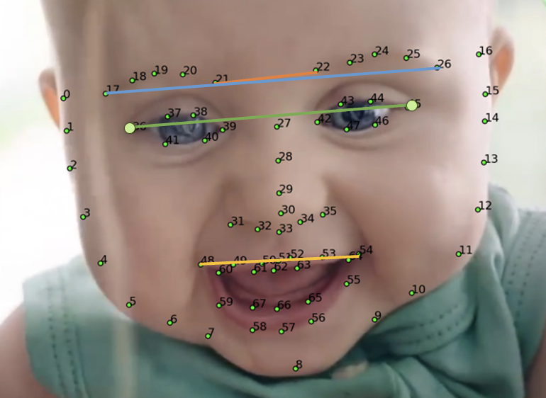

# DS5110 faces: Notes on Logistic Regression Exploration (euclidean distance) - Sophia
The purpose of this file is to contain all the notes and testing related to logreg model exploration (take 3).

## EDA
We had the idea of trying to identify more "distances" between facial features that could help classify adults vs infants. We know from the paper and our original logreg exploration (take 1) that the ratio between the width and height of the head (boxratio) and distance between the eyes are good for this. Could there be more?

The EDA for this idea involved selecting one image and plotting the matrix of the euclidean distances. After generating the new data for all the points, I also attempted a correlation matrix of all the distances. I wanted to see if removing highly correlated points would make feature selection go faster, but I couldn't figure out the right way to do this that would still preserve the accuracy of the model. I ended up trying a new feature selection method (forward feature selection rather than backwards) and just dealing with the fact that it takes a long time to run the more features you consider. 


## Data used
Infant and adult raw coordinate data can be found from this repo: [Infant-Facial-Landmark-Detection-and-Tracking](https://github.com/ostadabbas/Infant-Facial-Landmark-Detection-and-Tracking).

## Preprocessing
For this model exploration I created additional metadata which computed the euclidean distances between the coordinate points (using normalized to the bounding box data as the coord input - see this document for information on how the normalized points were generated: `preprocessing.md`). Please see `sc_euc_metadata.py` for details on the calculations.

## Results
We approached this idea from 2 ways. We first wanted to see given **all** the information (euc distance from every point to every other point) what distances/features would the model choose, and how many would the model need until we got to a decent accuracy and recall score? We also were curious about what order it added those features in. 

**One feature**
Feature selected: ['dist_7_48'] 
* Accuracy score: 0.74 (no downsampling)
* Accuracy score: 0.82 (downsampling)
* Recall score adult: 0.86 (downsampling)
* Recall score baby: 0.78 (downsampling)

**Two feature**
Feature selected: ['dist_7_48', 'dist_33_42'] 
* Accuracy score: 0.83 (no downsampling)
* Accuracy score: 0.91 (downsampling)
* Recall score adult: 0.93 (downsampling)
* Recall score baby: 0.89 (downsampling)

**Three feature**
Feature selected: ['dist_7_48', 'dist_21_22', 'dist_33_42'] 
* Accuracy score: 0.91 (no downsampling)
* Accuracy score: 0.94 (downsampling)
* Recall score adult: 0.98 (downsampling)
* Recall score baby: 0.89 (downsampling)

**Four feature**
Feature selected: ['dist_7_48','dist_18_25','dist_21_22', 'dist_33_42'] 
* Accuracy score: 0.94 (no downsampling)
* Accuracy score: 0.98 (downsampling)
* Recall score adult: 0.98 (downsampling)
* Recall score baby: 0.98 (downsampling)

**Five feature**
Feature selected: ['dist_7_9', 'dist_7_48', 'dist_18_25', 'dist_21_22', 'dist_33_42']
* Accuracy score: 0.95 (no downsampling)
* Accuracy score: 0.98 (downsampling)
* Recall score adult: .98 (downsampling)
* Recall score baby:  .97 (downsampling)

**Six feature**
Feature selected: ['dist_5_7', 'dist_7_9', 'dist_7_48', 'dist_18_25', 'dist_21_22', 'dist_33_42']
* Accuracy score: 0.97 (no downsampling)
* Accuracy score: 0.98 (downsampling)
* Recall score adult: .98 (downsampling)
* Recall score baby:  .98 (downsampling)


We then wanted to see given only some distances, would the classifier be able to generate a good score? We heuristically chose these landmarks based on what we thought would be valuable. The distances chosen are as follows:
Left(L) brow width(W)
Right(R) brow width(W)
Inner(I) brow distance(D)
Outer(O) brow D
Leye W
Reye W
I eye D
O eye D
Leye to Lbrow
Reye to Rbrow
Ear to ear
Chin to chin
Chin to nose
Mouth W 
Mouth height(H)
Mouth center to eye center
Nose center to Leye
Nose center to Reye
Lip to Lbrow
Lip to Rbrow
Lchin to REar
Lchin to mouth center
Lchin to nose
Lchin to Leye
Lchin to Reye
Chin to Mouth

Visual representation of what we picked:


**One feature**
Feature selected: ['dist_7_48']
* Accuracy score: 0.74 (no downsampling)
* Accuracy score: 0.82 (downsampling)
* Recall score adult: 0.86 (downsampling)
* Recall score baby: 0.78 (downsampling)

**Two feature**
Feature selected: ['dist_7_48', 'dist_33_42']
* Accuracy score: 0.83 (no downsampling)
* Accuracy score: 0.91 (downsampling)
* Recall score adult: 0.93 (downsampling)
* Recall score baby: 0.89 (downsampling)

**Three feature**
Feature selected: [['dist_7_48', 'dist_21_22', 'dist_33_42']
* Accuracy score: 0.91 (no downsampling)
* Accuracy score: 0.94 (downsampling)
* Recall score adult: 0.98 (downsampling)
* Recall score baby: 0.89 (downsampling)

**Four feature**
Feature selected: ['dist_7_48', 'dist_18_25', 'dist_21_22', 'dist_33_42']
* Accuracy score: 0.94 (no downsampling)
* Accuracy score: 0.98 (downsampling)
* Recall score adult: .98 (downsampling)
* Recall score baby:  .98 (downsampling)



## Reproduce Results
To reproduce the results from these notes run:
```
make logreg_test
```
Note that this file has all 5 partitions and multiple combinations (feature selection, no feature selection, sampling, no sampling) so a lot gets output to the console and graphs generated. However it should run quickly and there are print statements that tell you what classificaition report you are looking at, etc.

To reproduce the data used in these notes, run `?jesse file?` and `dist_metadata.py`

To reproduce the eda used in these notes run:
```
make logreg_eda
```
To reproduce the testing for the sampling used in these notes run:
```
make resample_test
```