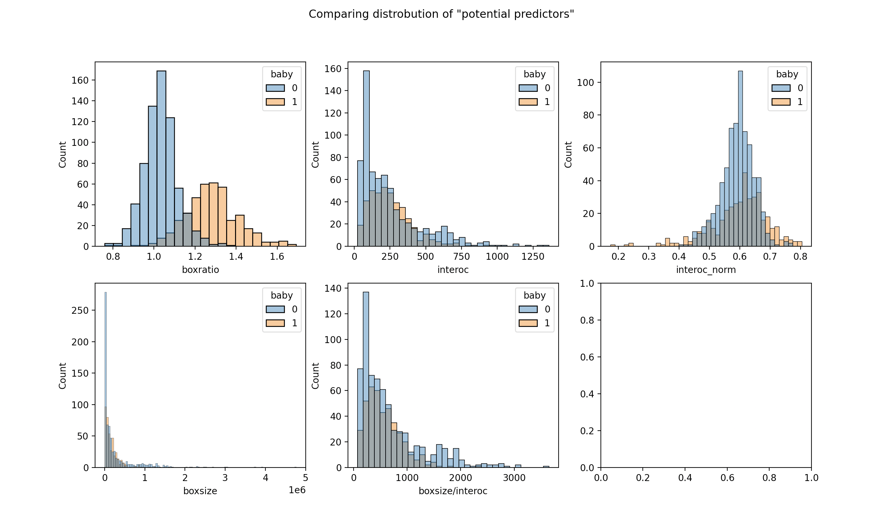
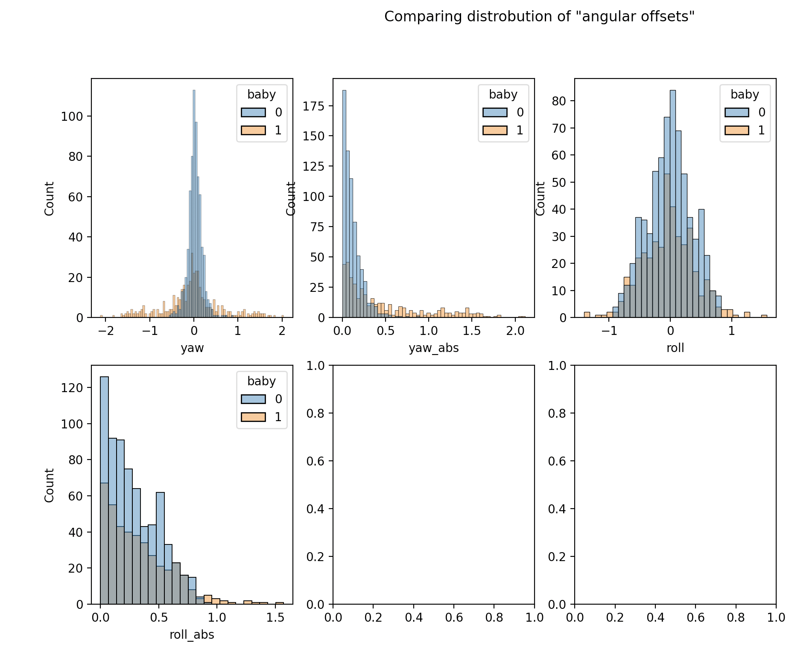
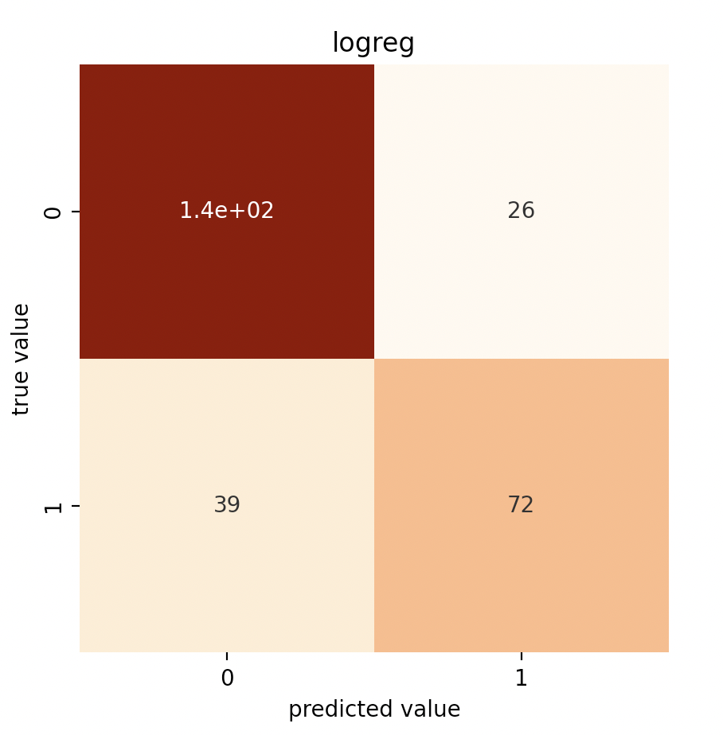
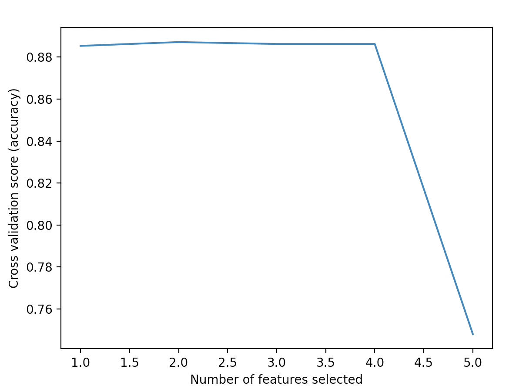
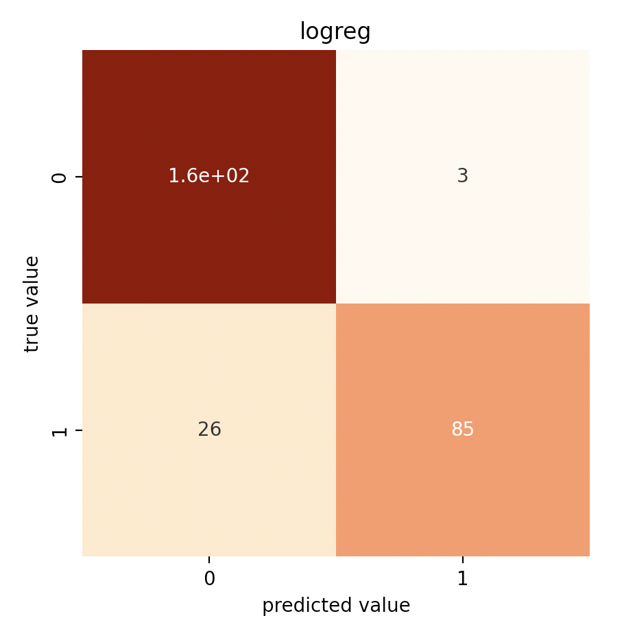
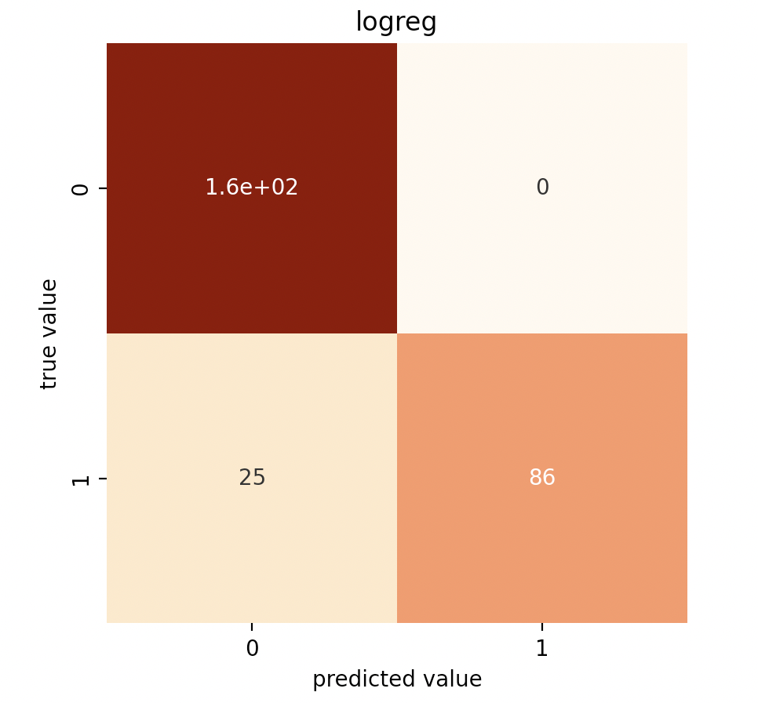
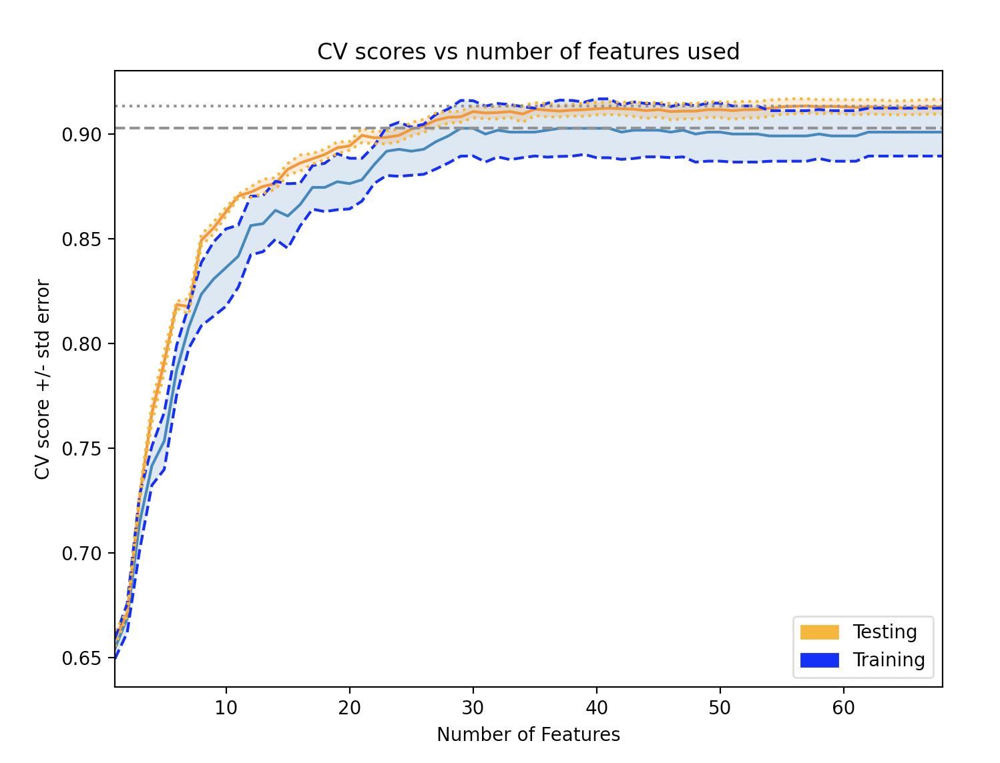
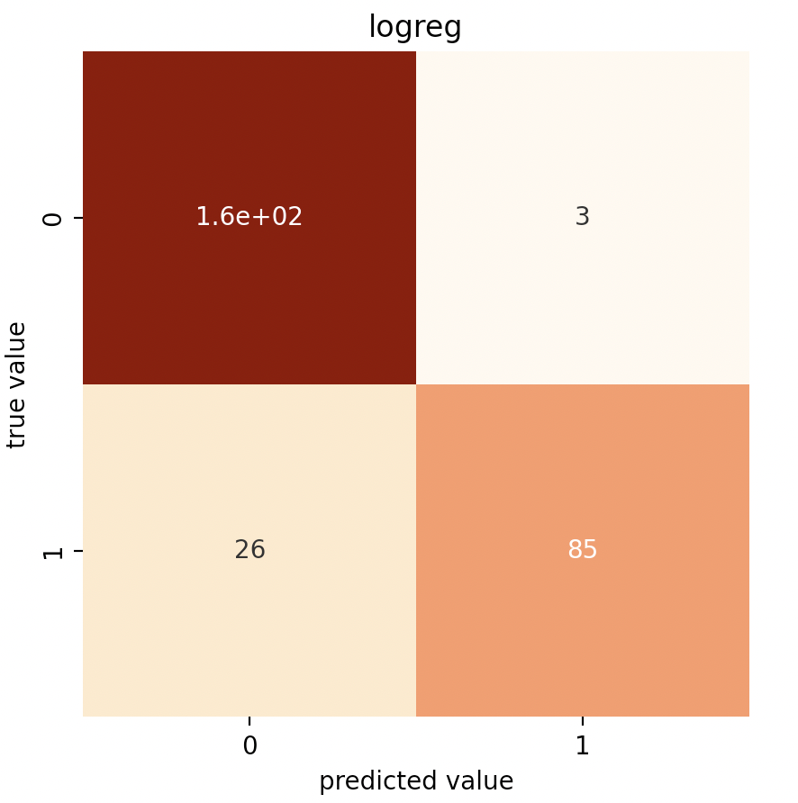
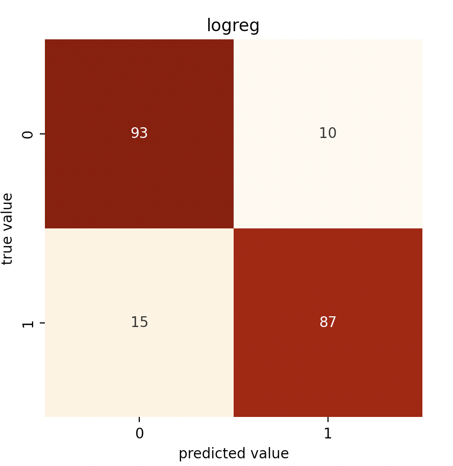

# DS5110 faces: Notes on Logistic Regression Exploration - Sophia
The purpose of this file is to contain all the notes and testing related to logreg model exploration (take 2).

## EDA
I plotted the distribution of the "potential predictors" using histograms for both babys and adults. I was looking to see if any of the features seemed separable (thinking that would work well for logreg). I noted that the "boxratio" looked alright but the other ones did not look very separable.





## Data used
Infant and adult raw coordinate data can be found from this repo: [Infant-Facial-Landmark-Detection-and-Tracking](https://github.com/ostadabbas/Infant-Facial-Landmark-Detection-and-Tracking).

For this model exploration I used several "partitions" of the data. Information on how these partitions were created can be found [here](https://github.com/ds5110/faces/blob/main/preprocessing.md).

* Partition 1: The "potential predictors" 
  * Aka `['boxratio', 'interoc','interoc_norm','boxsize','boxsize/interoc']`
* Partition 2: The "norm_cenrot-" columns
  * aka coords transformed to correct yaw and position & normalized to the minimum bounding box

## Results
**Partition 1: The "potential predictors"**
This partition produced good results after feature selection and downsampling. The 2 features selected were `['boxratio', 'interoc']` (reinforcing paper findings).

Without feature selection:
* Accuracy score: 0.76
* Recall score adult: 0.84
* Recall score baby: 0.65

Confusion matrix:



With feature selection:
* Optimal features is 1
* Accuracy score: .89
* Recall score adult: 0.98
* Recall score baby: 0.77

CV to tune optimal features:



Confusion matrix:



With feature selection & downsampling:
* Accuracy score: 0.88
* Recall score adult: 0.90
* Recall score baby: 0.85

Confusion matrix:


**Partition 2: The "norm_cenrot" column**
This partition was pretty strong even before feature selection (is overfitting a possibility? It is a lot of features).

Without feature selection:
* Accuracy score: 0.96
* Recall score adult: 1.00
* Recall score baby: 0.77

Confusion matrix:



With feature selection:
* Optimal features is 29
* Accuracy score: .91
* Recall score adult: 1.00
* Recall score baby: 0.77

CV to tune optimal features:



Confusion matrix:



With feature selection & downsampling:
* Accuracy score: 0.93
* Recall score adult: 0.92
* Recall score baby: 0.94

Confusion matrix:



## Reproduce Results
To reproduce the results from these notes run:
```
make logreg_test
```
To reproduce the eda used in these notes run:
```
make logreg_eda
```
To reproduce the testing for the sampling used in these notes run:
```
make resample_test
```
