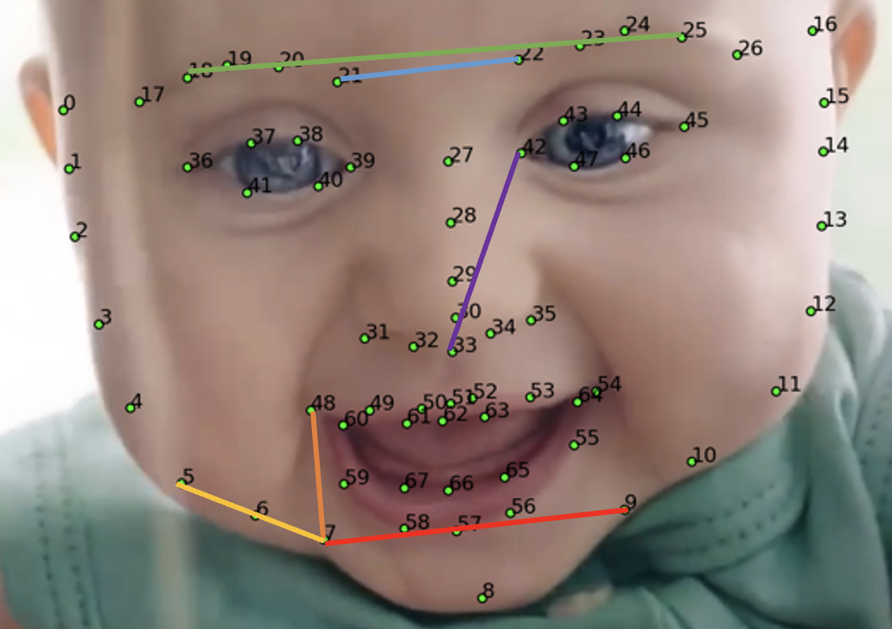
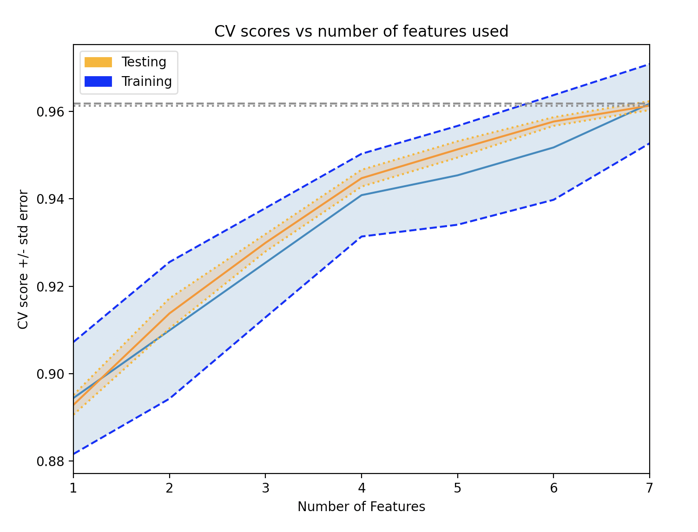

# DS5110 faces: Logistic Regression Exploration Summary - Sophia
The purpose of this file is to explain the main takeaways from the logreg model exploration.

More information about EDA, sampling methods attempted, hyper-parameter tuning, and data partitions tested please see `notes/sc_notes_logreg` and `notes/sc_notes_logreg_dist`.

## Logistic Regression: Take 1
One of our goals is to test out different forms of resampling to balance the data. We wanted to know if resampling would have a positive impact on model accuracy. We found that "downsampled" scores were consistently better (even if it reduced the accuracy rating by 0.1 or so, the recall scores greatly improved), so we can conclude that downsampling is a good strategy for this model. 

In the spirit of simple models being the "best", the "one feature" model stood out to us as pretty good. For more information on how this model preformed with other groups of features, please see `notes/notes_logreg`. We got to this model by using recursive feature selection to select the best (and minimum) number of features.

Using other feature groups such as the `norm_cenrot` columns did not yeild very promising results. This could be due to coliniarity, given the nature of the data (too many similar coordinate points). 

One feature (`['boxratio']`), downsampling:
* Accuracy score: 0.88
* Recall score adult: 0.90
* Recall score baby: 0.85

Confusion matrix:


## Logistic Regression: Take 2
Inspired by our sucess with using `boxratio` (ratio between the width and height of the head) as a single predictor, we had the idea of trying to identify more "distances" between facial features that could help classify adults vs infants.

After generating the pairwise euclidian distances, it became really obvious that we would need feature selection given the ammount of features. In fact, if you tried to run this model with all these new features, you run the risk of way overfitting the model. We thought that forward feature selection would be a good choice, as we can easily identify how and which additional distances will imporve the model. 

We also used downsampling here given the sucess of downsampling with the previous set of features.

We found that the classifier produced a pretty good score with just one feature, the euclidian distance from the left chin to left eye.
**One feature**
Feature selected: ['dist_7_48'] (distance from the left chin to left mouth corner)
* Accuracy score: 0.74 (no downsampling)
* Accuracy score: 0.82 (downsampling)
* Recall score adult: 0.86 (downsampling)
* Recall score baby: 0.78 (downsampling)

We saw that adding more features did yeild improvements until 4 around features.

**Two feature**
Feature selected: ['dist_7_48', 'dist_33_42'] (new is nose to right eye corner)
* Accuracy score: 0.83 (no downsampling)
* Accuracy score: 0.91 (downsampling)
* Recall score adult: 0.93 (downsampling)
* Recall score baby: 0.89 (downsampling)

**Three feature**
Feature selected: ['dist_7_48', 'dist_21_22', 'dist_33_42'] (new is distance between eyebrows)
* Accuracy score: 0.91 (no downsampling)
* Accuracy score: 0.94 (downsampling)
* Recall score adult: 0.98 (downsampling)
* Recall score baby: 0.89 (downsampling)

**Four feature**
Feature selected: ['dist_7_48','dist_18_25','dist_21_22', 'dist_33_42'] (new is distance from mid eyebrow to mid eyebrow)
* Accuracy score: 0.94 (no downsampling)
* Accuracy score: 0.98 (downsampling)
* Recall score adult: 0.98 (downsampling)
* Recall score baby: 0.98 (downsampling)

**Five feature**
Feature selected: ['dist_7_9', 'dist_7_48', 'dist_18_25', 'dist_21_22', 'dist_33_42']
* Accuracy score: 0.95 (no downsampling)
* Accuracy score: 0.98 (downsampling)
* Recall score adult: .98 (downsampling)
* Recall score baby:  .97 (downsampling)

**Six feature**
Feature selected: ['dist_5_7', 'dist_7_9', 'dist_7_48', 'dist_18_25', 'dist_21_22', 'dist_33_42']
* Accuracy score: 0.97 (no downsampling)
* Accuracy score: 0.98 (downsampling)
* Recall score adult: .98 (downsampling)
* Recall score baby:  .98 (downsampling)



## Logistic Regression: Bringing it together
In the first iteration of this exploration, we found that `boxratio` was a good single predictor. In the second iteration, we found other distances that could be useful in classifying baby vs adult faces. Adding these features together (specifically `boxratio` with euclidean distance `'dist_5_7', 'dist_7_9', 'dist_7_48', 'dist_18_25', 'dist_21_22', 'dist_33_42'`) yeilded a model with:
* Accuracy score: 0.96
* Recall score adult: 0.99
* Recall score baby: 0.93

Interestingly, the feature selection considered all of them important because each additional distance added accuracy to the model. 



I think this is a good model because the accuracy rate and recall scores are quite good and it doesn't require a ton of features.


## Reproduce Results
To reproduce the results from this section run:
```
make logreg_test
```