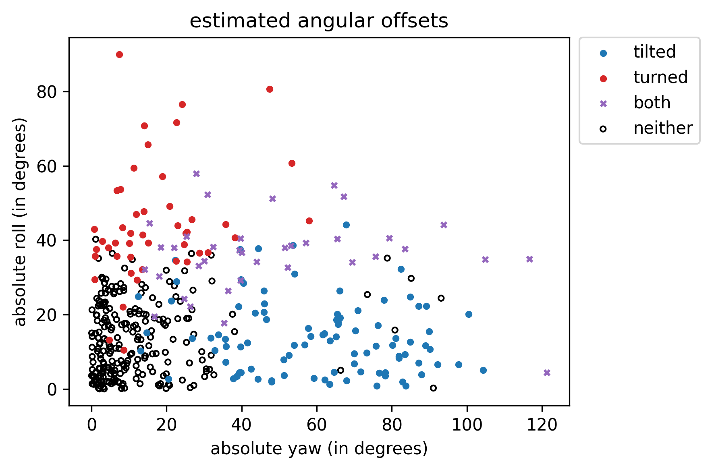

# Preprocessing

We created a Makefile target `merge_meta` to calculate the derived features.

**IMPORTANT**: This downloads **all** of the baby images to a local cache (in order to get accurate image dimensions to avoid cropping content during centering/rotating):
```
make merge_meta
```
To calculate the euclidean pair-wise distances:
```
make <make-target>
```

## Derived Features Reference

We added some derived metadata to the [original dataframe](https://coe.northeastern.edu/Research/AClab/InfAnFace/labels.csv).

### Derived Landmark Coordinates
Where `dim` is 'x' or 'y' and `index` is an integer [0-67]

* `norm-{dim}{index}`
  * normalized to the minimum bounding box of landmarks
  * landmark 33 at image center
* `cenrot-{dim}{index}`
  * transformed to correct yaw and position
  * landmark 33 at image center
* `norm_cenrot-{dim}{index}`
  * transformed to correct yaw and position
  * normalized to the new minimum bounding box
  * landmark 33 at image center

### Differences of expected symmetric landmarks
Where `dim` is 'x' or 'y' and `index` is an integer [0-67] (the left-most point of the pair, viewer's perspective)
* `sym_diff-{dim}{index}`: difference of raw coordinates (probably not very useful)
* `cenrot_sym_diff-{dim}{index}`: difference of yaw-corrected coordinates
* `norm_cenrot_sym_diff-{dim}{index}`: difference of yaw-corrected coordinates, normalized per min box

### Euclidean pair-wise Distances Between Landmarks
We calculated the euclidean pair-wise distances for all the normalized (to the bounding box) coordinate data. This gives us "distances" from every landmark point, to every other landmark point (for example, the "distance" between the left mouth conrner and left eye). We used the normalized data to account for scale.
* `dist_{}_{}`:  euclidean pair-wise distance from xy point to another xy point

### Angular offsets (anchor link to details?)
* `yaw`: estimated rotation about the z-axis
* `yaw_abs`: magnitude of `yaw`
* `roll`: estimated rotation about the y-axis
* `roll_abs`: magintude of `roll`

### Potential predictors for distinguishing infants
* `boxratio`: width of min box divided by height of min box
* `interoc`: distance between outer corners of eyes (or outer canthi)
* `interoc_norm`: `interoc` normalized per width/height of yaw-corrected min box
* `boxsize`: area of the bounding box. 
* `boxsize/interoc`: boxsize divided by interocular distance

## Angular Features

You can recalculate the estimated angular offset features:
```commandline
python src/add_derived.py
```

In our initial exploration we tried plotting landmarks on a frontal view example image:


Then we tried drawing splines between subsets of points, to make detected features more clear:


We also tried to standardize the orientation by centering and rotating about the z-axis (using expected symmetry between eye landmarks to calculate the angle of rotation):


To confirm this, we applied this rotation/centering on a few other images:


Depending on the input data and type of models we are training, this type of preprocessing may be useful.

You can generate these images with the following [Makefile](Makefile) target:
```
make prelim_plots
```

## Angular transformations

We would like to derive three components of head orientation: "roll", "pitch", and "yaw". We regard these from a graphical perspective: about the y-axis, x-axis, and z-axis, respectively (as opposed to anatomical terminology, where yaw might be about the medial axis, etc).

## Calculation of "yaw"

The calculation for yaw is a simple weighted average of angles between key landmarks (mainly the corners of eyes, or "canthi"). This has proven very effective, as manually verified for nearly all of the training data.

## Calculation of "roll"

The calculation for "roll" is much more tenuous. We assume the head is a sphere, with diameter equal to the maximum horizontal distance between cheek landmarks (after "yaw correction"). Then we take the nose point (landmark 33) as a point on the surface of said sphere and calculate the angle: `roll = arcsin((nose-mid)/radius)`


## Visualizing estimates

We plotted raw estimated angles against given categories "tilted" and "turned":


The classes are more linearly seperable when taking absolute values:



You can reproduce these plots with the following `Makefile` target:
```
make roll_yaw
```

We applied a simple Logistic Regression model to confirm the relationships between estimated angles and given labels:
```
looking at "tilted" per ['yaw_abs'] (n: 410; p: 1)
	logreg score: 0.893
	dummy score: 0.466
looking at "tilted" per ['roll_abs'] (n: 410; p: 1)
	logreg score: 0.631
	dummy score: 0.417
looking at "tilted" per ['yaw_abs', 'roll_abs'] (n: 410; p: 2)
	logreg score: 0.893
	dummy score: 0.495
looking at "turned" per ['yaw_abs'] (n: 410; p: 1)
	logreg score: 0.777
	dummy score: 0.466
looking at "turned" per ['roll_abs'] (n: 410; p: 1)
	logreg score: 0.913
	dummy score: 0.466
looking at "turned" per ['yaw_abs', 'roll_abs'] (n: 410; p: 2)
	logreg score: 0.932
	dummy score: 0.544
```

This shows that 'yaw_abs' predicts 'tilted' with ~90% accuracy and 'roll_abs' predicts 'turned' with >90% accuracy.

This can be reproduced by the `angles_logreg` Makefile target:
```
make angles_logreg
```

## Outliers

There are a few outliers, but they seem to be caused by inconsistent labeling or different ways of interpreting ~90 degree rotations. For example, the face with the maximum absolute yaw score among images labeled neither "tilted" nor "turned" is clearly not upright, presumably "tilted":


To plot the first 10 such outliers, you can use this `Makefile` target:
```
make angle_outliers
```