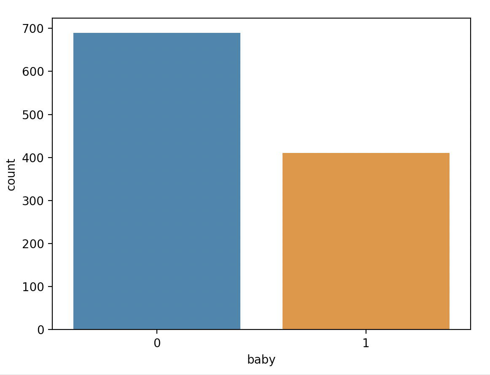
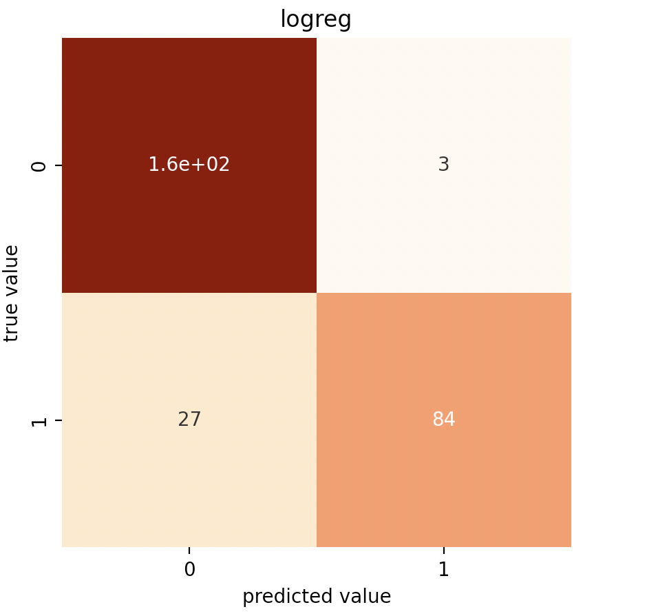

# Resampling
We noticed that the dataset was somewhat unbalanced with more adult data (689) points than baby data (410) points. Generally classification models preform better with balanced data, so we wanted to provide some options such as upsampling and downsampling. 

We also looked at specific metrics such as recall score, and plotted the confusion matrix before and after resampling to see if resampling allowed for less false negatives and false positives. The idea here is that we want to ensure that our model isn't "missing" too many instances of the minority class.



To re-create the image above, run:
```
make logreg_eda
```

## Upsampling
Up-sampling is the process of randomly duplicating observations from the minority class in order to reinforce its signal. We ended up not using this method beyond testing-purposes as downsampling seemed to be getting us decent scores (and we didn’t necessarily want duplicated data).

## Downsampling

Logreg Examples:

**One features**
Before downsampling:
* Accuracy score: .89
* Recall score adult: 0.98
* Recall score baby: 0.77

Confusion matrix:



After downsampling:
* Accuracy score: 0.88
* Recall score adult: 0.90
* Recall score baby: 0.85

Confusion matrix:


To re-create the testing of the resampling functions, run:
```
make resample_test
```
Plese see `logreg.md` for more information about how our logistic regression model preformed with resampling (and to recreate the figures/reports above). 