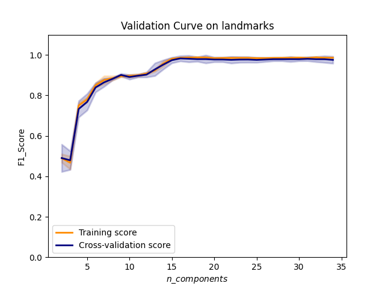

## SVC

Applied SVC to original data (landmarks) and to geometric values. 

### Original Data

The original data consists of the position of landmarks. There are 68 landmarks and two indices, x and y, for each landmark so there are 136 predictors in total.

Considering the number of predictors, we applied `PCA` first to reduce the dimensionality and then used `SVC` for classification. `GridSearchCV` is used to find the best hyperparameters for the SVC model.

Bellow are the hyperparameters of `PCA` and `SVC`, and performance on original landmarks.

The score of original landmarks could be an upper bound for model performance since it contains all information in the landmarks. 

This performance is already high enough. Even if it might be further improved, the improvement will be tiny. Preprocessing like centering, rotating to upright position and scaling are needed to directly use the landmarks.

Bellow is the confusion matrix of classification.

This is a scatter plot of the first two principal components. There is no obvious pattern visible in the plot.

Validation curve on `n_components`. The `F1_score` is actually pretty good when `n_components=15`

### Geometric Values

The two geometric values used here are `boxratio` and `interoclar_norm`. They correspond to the `box width / box height` and `box size / interocular didtance` in `TABLE II` of Dr. Wan's paper. 

Bellow are the hyperparameters of `SVC`, and performance on geometric values. The last lines shows the number of support vectors in the train data.

The performance on the two geometric values is nice and this could serve as a lower bound since it requires only the ratio of box width to box height and box size to interocular distance.

Little preprocessing is needed givens the bounding box and landmarks. It’s also more interpretable as we know the meaning of the predictors. More predictors might be added to improve its performance.

Bellow is the confusion matrix of classification.

Here is a scatter plot with `boxratio` and `interoc_norm` as axis. The points tend to be in two groups though there are some overlapping. 

The pattern in the scatter plot above is quite obvious, so we also circled the support vectors wanting to see if there still exists any pattern.

Unfortunately, there are too many support vectors so the picture is messy, and no pattern is visible here.

