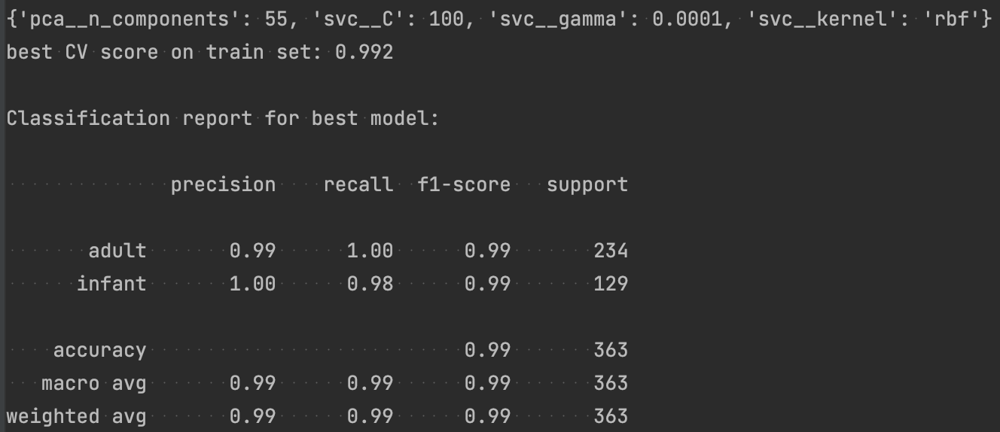
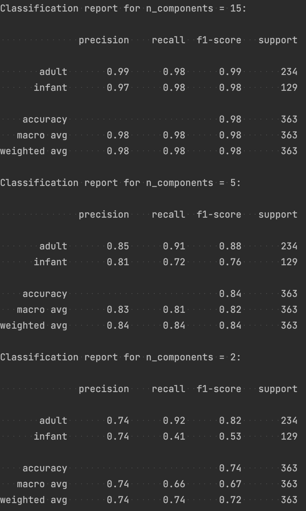
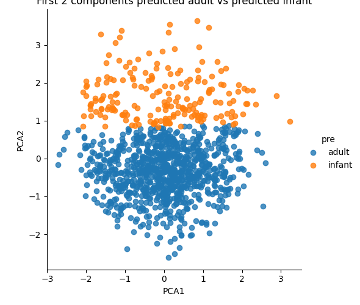
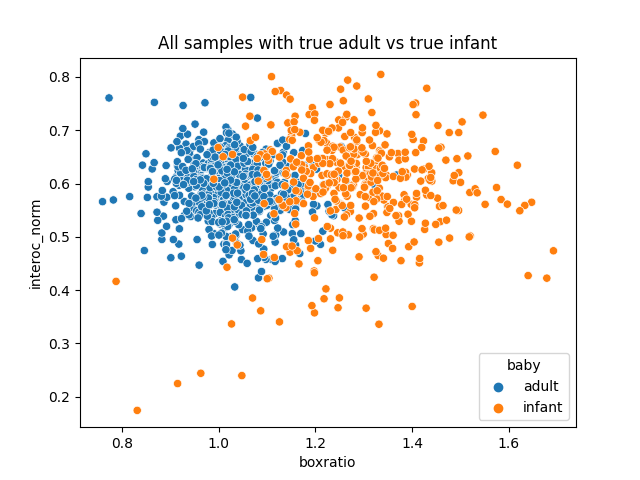
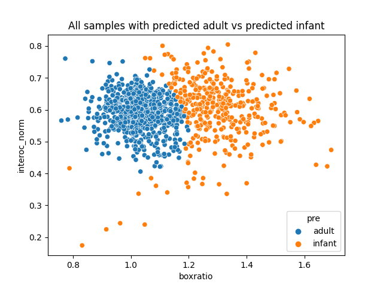
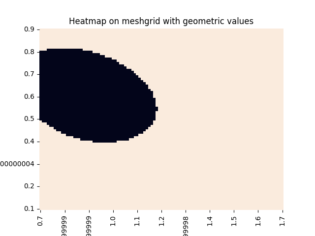

## SVC

Applied SVC to landmarks and to geometric values. 

`GridSearchCV` in both methods are applied to the train set, and classification reports are generated from the test set.

### Landmarks

There are 68 landmarks and two axis, x and y, for each landmark so there are 136 predictors in total.

Considering the number of predictors, we first applied `PCA` to reduce the number of dimension and then used `SVC` for classification. `GridSearchCV` is used to find the best hyperparameters for both `PCA` and `SVC`.

Bellow are the hyperparameters of `PCA` and `SVC`, and classification report on landmarks.

The score of landmarks could be an upper bound for model performance since it contains all information in the landmarks. 

This performance is already high enough. Even if it might be further improved, the improvement will be tiny. Preprocessing like centering, rotating to upright position and scaling are needed here.

Bellow is the confusion matrix of classification.

Validation curve on `n_components`. The `F1_score` is actually pretty good when `n_components=15`

So we printed more classification reports with different number of principal component. Other hyperparameters are the same as in the previous model.

The score for `n_components = 15` is still pretty good, and `n_components = 5` is not that bad. But `n_components = 2` is simply guessing for the infant samples.

As the scatter plot of the first two principals shows bellow, the model with `n_components = 2` just predict the lower half part to be andult.

### Geometric Values

Now we use the two geometric values, `boxratio` and `interoclar_norm`, as predictors. They correspond to the `box width / box height` and `box size / interocular didtance` in `TABLE II` of Dr. Wan's paper. 

Bellow are the hyperparameters of `SVC`, and performance on geometric values. The classification report is generated on the test set, and the last lines shows the number of support vectors in the train set with 736 samples.

The performance on the two geometric values is nice and it's between the performance with `n_components = 5` and `n_components = 15` in the model using landmarks. This could serve as a lower bound since it requires only the ratio of box width to box height and box size to interocular distance.

Little preprocessing is needed givens the bounding box and landmarks. It’s also more interpretable as we know the meaning of the predictors.

Bellow is the confusion matrix of classification.

Here is a scatter plot with `boxratio` and `interoc_norm` as axis. The points tend to be in two groups though there are some overlapping. 

And if we draw the same scatter plot with predicted value vs true value. 

Same plot on a meshgrid.

The support vectors in the train set. They tend to form a curved boundary between infant and adult samples. 

